# 🐷 MalaShabu - Restaurant Management System

A Java Swing desktop application for managing a Shabu restaurant — handling menu items, employees, and orders with a simple file-based storage system.

---

## 📸 Screenshots

### Login & Main Menu
| Login | Main Menu |
|-------|-----------|
| 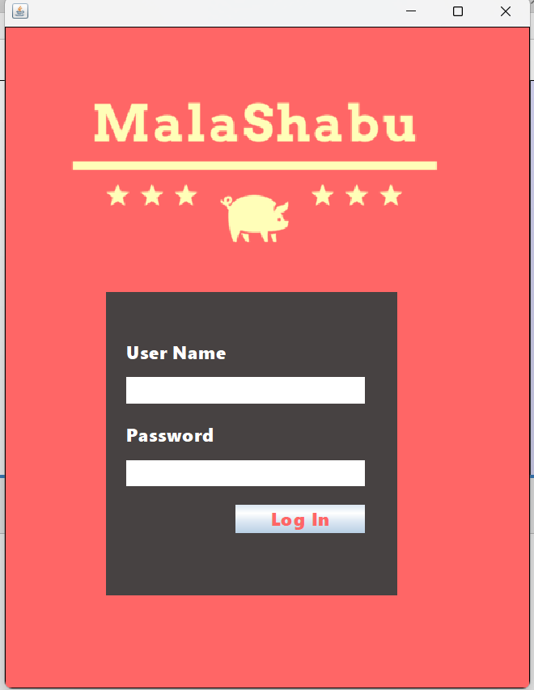 | 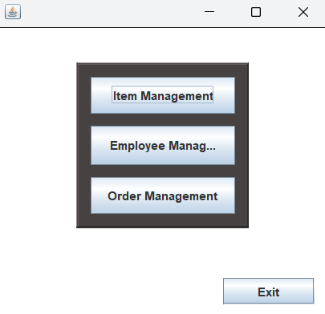 |

### Item Management
| Item Management Menu | Add Item |
|----------------------|----------|
| 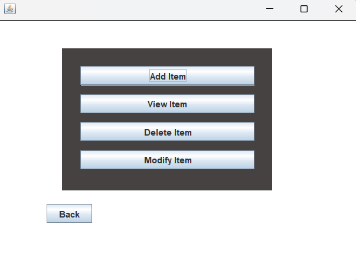 | 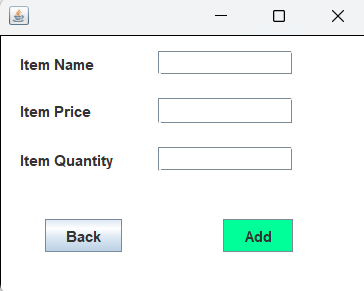 |

| View Item | Delete Item | Update Item |
|-----------|-------------|-------------|
| 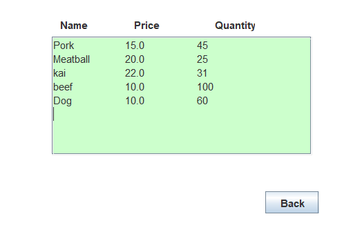 | 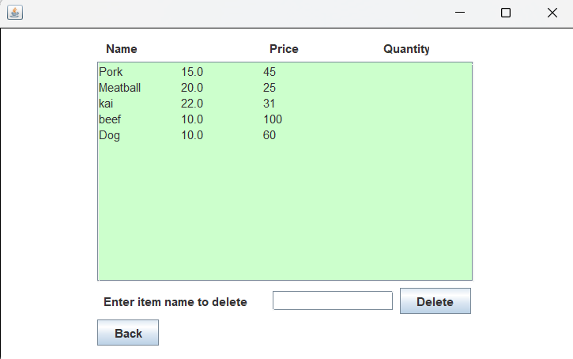 | 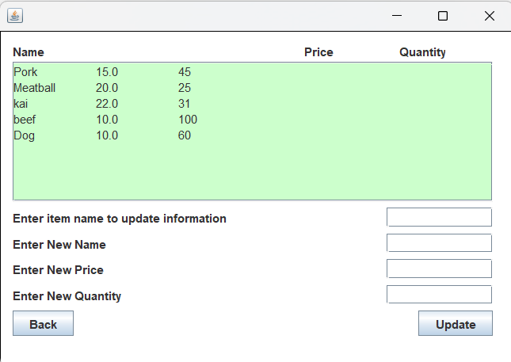 |

### Employee Management
| Employee List | Add Employee |
|---------------|--------------|
| 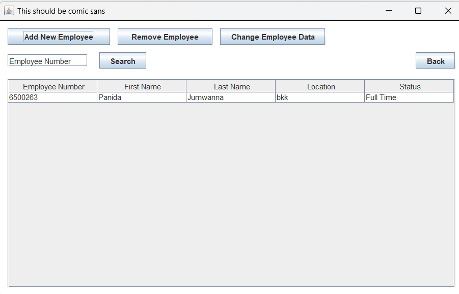 | 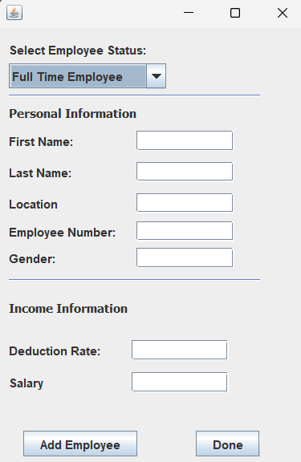 |

| Remove Employee | Change Employee Data | Employee Detail |
|-----------------|----------------------|-----------------|
| 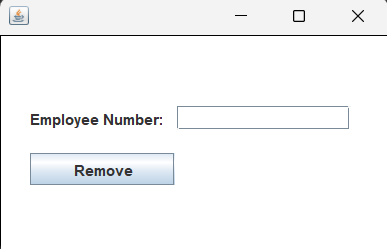 | 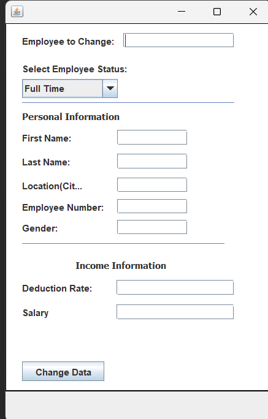 | 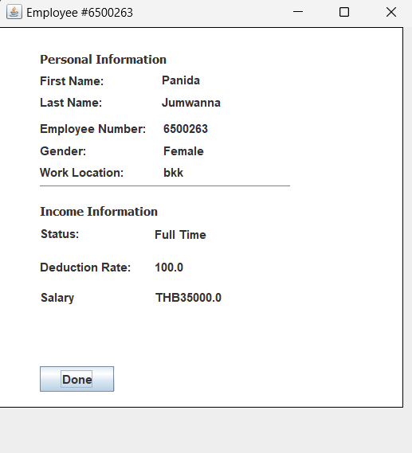 |

### Order Management
| Order Management |
|------------------|
| 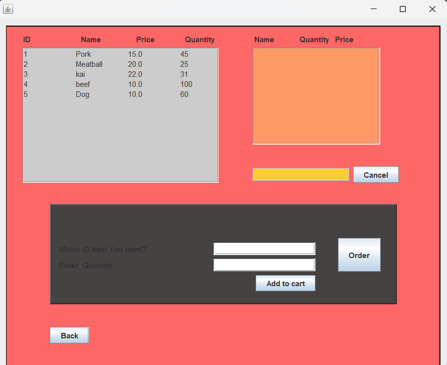 |

---

## ✨ Features

- **Authentication** — Login system with auto-lock after 3 failed attempts
- **Item Management** — Add, view, update, and delete menu items
- **Employee Management** — Manage staff records (Full-time & Part-time)
- **Order Management** — Create and manage customer orders
- **File-based Storage** — Data stored in plain `.txt` files, no database required

---

## 🛠️ Tech Stack

- **Language:** Java
- **UI Framework:** Java Swing (NetBeans Form Designer)
- **Storage:** File-based (`.txt`)
- **Build Tool:** Apache Ant (`build.xml`)
- **IDE:** NetBeans / VS Code

---

## 🚀 Getting Started

### Prerequisites
- Java JDK 8 or higher
- VS Code + [Extension Pack for Java](https://marketplace.visualstudio.com/items?itemName=vscjava.vscode-java-pack)

### Run the App

1. Clone the repository
```bash
git clone https://github.com/YOUR_USERNAME/MalaShabu.git
cd MalaShabu
```

2. Open `src/MalaShabu/system/Main.java` in VS Code

3. Right-click → **Run Java**

Or using Ant:
```bash
ant run
```

---

## 🔑 Default Credentials

```
Username : admin
Password : 1234
```

> ⚠️ The system will exit automatically after 3 incorrect login attempts.

---

## 📁 Project Structure

```
MalaShabu/
├── src/
│   └── MalaShabu/
│       ├── component/
│       │   ├── auth/          # Login screen
│       │   ├── item/          # Item management screens
│       │   ├── Employee/      # Employee management screens
│       │   └── order/         # Order management screens
│       ├── model/             # Data classes (Item, Order, etc.)
│       ├── service/           # Business logic
│       └── system/            # Main entry point & Main Menu
├── storage/                   # Data files (.txt)
├── screenshots/               # App screenshots
├── build.xml
└── README.md
```

---

## 📂 Data Storage

All data is stored in the `storage/` folder as comma-separated text files:

| File | Content |
|------|---------|
| `item.txt` | Item name, price, quantity |
| `order.txt` | Order records |
| `orderLine.txt` | Order line items |
| `labour.txt` | Employee records |

---

## 👨‍💻 Author

Developed as a university Programming course project.
